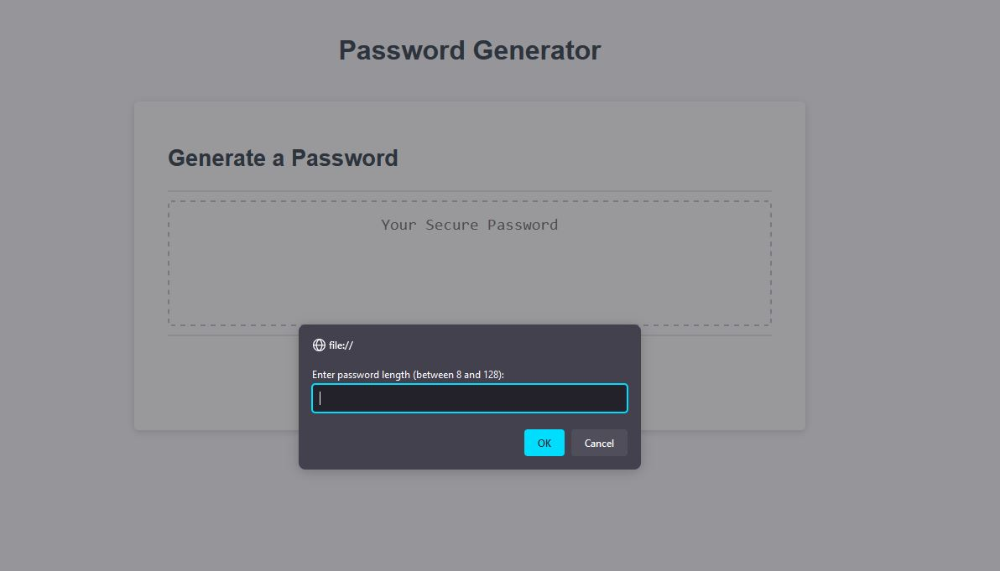

# Password Generator

##   Description

Scope of this project is to build a fully functional password generator which will prompt the user for: 
* Upper or lowercase letters

* the password length

* any special characters 

After a password meeting the user's criteria will be generated in the box on the page. 

## Installation

 - No installation needed, simply open the page and follow the prompts. 

## Usage 

* Page should look like the following: 

## Credits

* MDN web docs especially helped create this project. 

